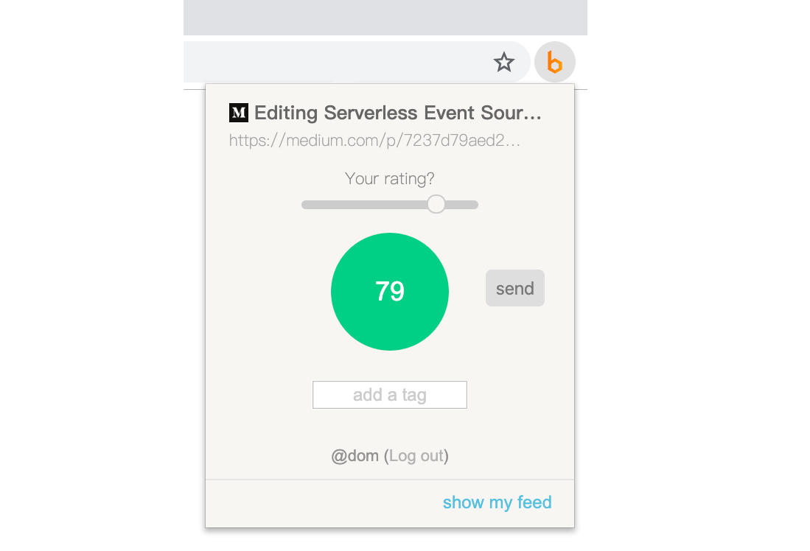
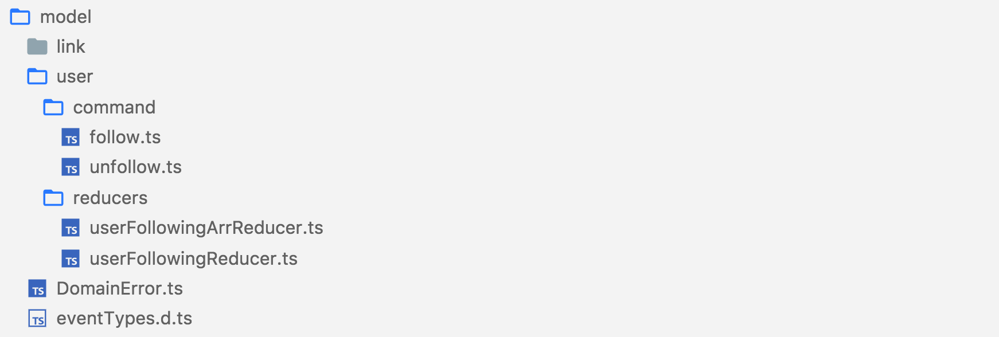
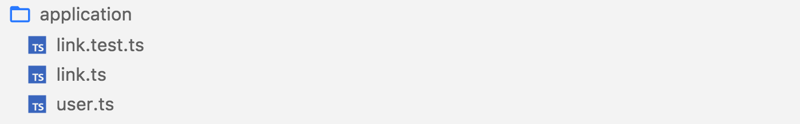
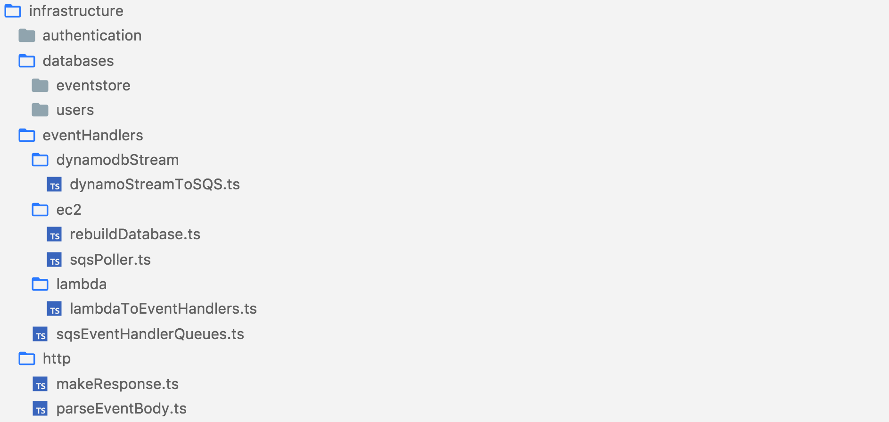
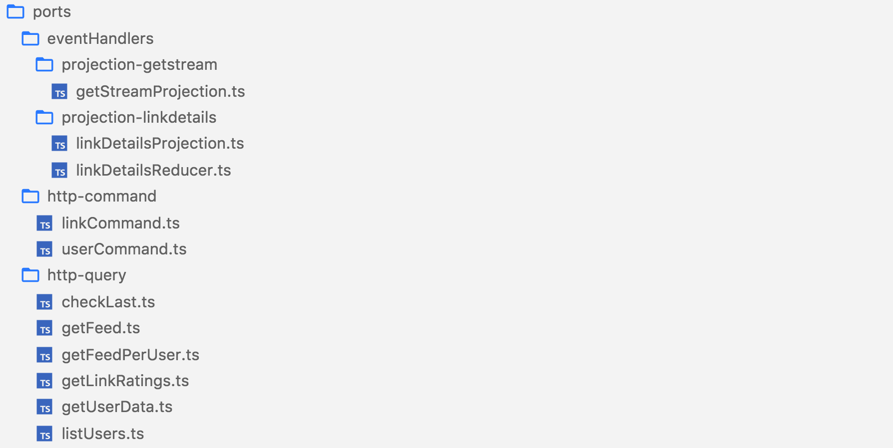

In this post, I have presented the project structured using **Event Sourcing** and **CQRS** patterns, written in **TypeScript**.

## Why use CQRS/Event Sourcing?

The project I was building was a “Twitter-like” service where instead of sending tweets, users would rate websites using a chrome extension.



In terms of database, I wanted to support the following queries:

- list all ratings per link
- list all ratings per user
- get (aggregated) user feed per user (since users can follow each other)

I’ve soon realized that what I needed wasn’t a single database model, but the ability to use multiple tools for different jobs.

Even though supporting these queries is not easy, when looking from a business domain point of view, the app itself is simple: Users can rate links and follow each other. Everything else happens as a result of those actions.

In event sourcing, that information is all you need.

To illustrate the point, here is a list of event types I used:

```
LINK_CREATED
LINK_RATED
LINK_TAGGED
LINK_TITLE_UPDATED
LINK_IMAGE_UPDATED
USER_FOLLOWED
USER_UNFOLLOWED
```

Each of those events contains additional data like `userId`, `linkUrl` or `linkTitle` but still, they are very easy to reason about.

Events about ratings are saved using `linkId` as a partition key (generated from `userId` + `linkUrl`), so “listing all ratings per user” query can easily be supported by “reducing” those events.

For aggregated user feeds, I’m using an event handler that listens to `LINK_RATED`, `USER_FOLLOWED` and `USER_UNFOLLOWED` events and then saving appropriate data using a “[getStream](https://getstream.io/)” API.

For “listing all ratings per link”, a second event handler updates a DynamoDB table with a `linkUrl` as a partition key.

If later on, I change my mind and realize that a different kind of database or a SAAS service is more suitable, I can easily make the switch by leveraging events in a different way, at any point in time.

## Architecture Overview

The project architecture is divided into two parts: **command** and **query** ([CQRS](https://martinfowler.com/bliki/CQRS.html)).

The command side is invoked every time something needs to change in the app (like rating a website or updating/deleting previously rated one). It is responsible for validating business rules and saving results in the form of events (`LINK_RATED`, `USER_FOLLOWED` etc).

The query side reacts to those events and updates a database which is then used to support various queries.


### Aggregate Boundaries

Even though events are often stored in a relational database, I found it easier to reason about them by using concepts of a NoSQL model.

For example, in MongoDB, documents are objects stored with an`_id` field that is used as a primary key. In a similar way, events can be stored in the event store, but, instead of an object, you can think of a document as an array of events.

And just as there are countless ways of deciding what constitutes a document in MongoDB, there are countless ways of deciding how those arrays of events should be grouped. It all depends on how you decide to “[design aggregate boundaries](https://infinitetree.eu/blog/2017/02/08/exploring-aggregate-boundaries-in-event-sourced-systems/)”.

For this project, events are categorized in the following manner:


But, before saving event(s) in a database, usually, some kind of validations must be made, and in most cases that can only be done by making conditions against previously stored data.

For example, in order to save `USER_FOLLOWED` event, there is a condition that the same user cannot be followed twice. To uphold this, I’m checking if user’s id is listed in an array of currently followed users:

```typescript
if (userFollowers.includes(followUserId)) {
  throw validationError('User is already followed')
}
```

However, since this kind of array is not stored anywhere, it must first be created.

This is done by retrieving all events for a certain user _(A5 in Fig. 3)_ and then passing them into a “reducer” where in case of `USER_FOLLOWED` event, a `userId` is added in an array, and in the case of `USER_UNFOLLOWED`, it is removed:

```typescript
const currentUserEvents = await eventStore.getById(userId)
const userFollowers = userFollowersReducer(currentUserEvents)

if (userFollowers.includes(followUserId)) {
  throw validationError('User is already followed')
}
```

```typescript
function userFollowersReducer(events: Event[], initialState = []): string[] {
  return events.reduce((followers: string[], e: Event) => {
    switch (e.type) {
      case 'USER_FOLLOWED':
        // add userId in array
        return [...followers, e.payload.followedUserId]
      case 'USER_UNFOLLOWED':
        // remove userId from array
        return followers.filter(userId => userId !== e.payload.unfollowedUserId)
      default:
        // keep array the same in case of any other event
        return followers
    }
  }, initialState)
}
```

**_Note_**_: If you prefer OOP style, rather than a “reducer” (a JavaScript implementation of a_ [_“fold” function_](https://en.wikipedia.org/wiki/Fold_%28higher-order_function%29)_), take a look at_ [_simple CQRS example_](https://github.com/gregoryyoung/m-r/blob/master/SimpleCQRS/Domain.cs) _written in C#._

After all business rules are satisfied, all that is left is saving event(s) in the event store _(A6 in Fig. 3)_:

```typescript
eventStore.save({
  events: [
    {
      type: 'USER_FOLLOWED',
      payload: {
        userId,
        followedUserId: followUserId,
      },
    },
  ],
  streamId: userId,
  expectedVersion: currentUserEvents.length,
})
```

### Optimistic Concurrency Control

Apart from specifying event data and a `streamId`, as you can see, I’ve also included the `expectedVersion` property. This is a form of [optimistic concurrency control](https://en.wikipedia.org/wiki/Optimistic_concurrency_control) and in this case, it prevents saving multiple events for the same aggregate, at the same time.

For example, imagine that a `followUser` command is simultaneously invoked two times. Since in both cases, the identical array would probably be created (from a history of, say, 10 events), it would come to a point of saving an identical result for both commands:


The problem is, if in both cases, a “USER_FOLLOWED” event is stored, it will break the rule of not following the same user multiple times.

However, since `expectedVersion: 10` is specified, only one of these commands will succeed, because, by the time a second one is executed, 11 events will already be stored in a database.

### Snapshots

Because every time a command is invoked, **all** events for a specific `streamId` (in this case — `userId`) are retrieved, you may be wondering, what happens if a user has thousands of events stored?

In that case, I’m using snapshots.

The idea is to pass previously stored state into a reducer, and apply only new events which happened after the snapshot was created:

```ts
const initState = await getSnapshot(userId)
const currentUserEvents = await eventStore.getById(userId, {
  offset: 1000, // assuming that snapshot was built from first 1000 events
})
const userFollowers = userFollowersReducer(currentUserEvents, initState)
```

But, this example is simplified. Snapshots are an optimization technique that comes with a price: versioning, inability to reuse events for additional reducers, updating snapshots for new events and additional requests to a database.

Here is how I’m actually using it (a snippet from another project):

```ts
const { state, version } = await eventStore.getByIdUsingSnapshot<VideoDetails>({
  id: event.data.videoId,
  reducer: videoDetailsReducer,
  reducerId: videoDetailsReducerId,
  reducerVersion: videoDetailsReducerVersion,
})

// state is a reduced object used to check business rules
// version is used as "expectedVersion" on eventStore.save()
```

Some of the complexity is hidden behind a`getByIdUsingSnapshot()` function where for every 1000 events, a new snapshot is created in [AWS S3](https://aws.amazon.com/s3/). In a snapshot itself (a JSON file) there is also a version included which is used to determine the offset used in getting new events from the event store.

As you can see, snapshots are useful but also introduce additional complexity. It’s good to avoid them if retrieving all events for an aggregate is not too expensive (which it often isn’t).

**_Note_**_: Sometimes, I’m using snapshots on the query side. This means that the same reducer is shared between a command and a query side.  
Needless to say, one should be careful when doing this, but for me, it saved a lot of time, especially in the early stages when a model was evolving more rapidly. Later on, if it proves to be too expensive, it’s not hard to switch to a “proper” read model._

## DynamoDB Event Store

I love DynamoDB because it’s fully managed and highly scalable, but it’s not often used as an event store. Reasons for that are issues related to consistency, ordering, and transactions.

### Consistency

In an example of invoking two commands simultaneously, I’ve already described how not maintaining consistency can result in invalid data stored in a database.

In DynamoDB, this can be solved with [Conditional writes](https://docs.aws.amazon.com/amazondynamodb/latest/developerguide/WorkingWithItems.html#WorkingWithItems.ConditionalUpdate). Since `expectedVersion` is a required property of the `save()` function, to store events in a database, there is a condition that the specified version must not already exist (for specific aggregate):

```ts
dynamoClient
  .put({
    TableName: esTable,
    Item: {
      commitId: syncTime + ':' + params.streamId,
      committedAt: syncTime,
      streamId: params.streamId,
      version: params.expectedVersion,
      events: JSON.stringify(events),
    },
    ConditionExpression: 'attribute_not_exists(version)',
    ReturnValues: 'NONE',
  })
  .promise()
```

When data is stored in DynamoDB, it’s replicated in three copies and a write request is acknowledged only after two copies are updated.

Because of that, there are two options in which items can be retrieved from a database: using a “strong consistency” or “eventual consistency”.

Since a version number is determined when events are retrieved from a database, with “eventual consistent reads” (a default and cheaper option), there is a possibility of getting outdated results. In that case, storing events can fail (with 409 error code). This is often resolved by retrying the operation until it succeeds.

If, however, a “strong consistency” option is used, two out of three DynamoDB copies are needed to retrieve a reliable result and 409 errors should only occur in case of parallel requests on the same aggregate.

### Ordering

Since the “eventstore“ table is created with a `streamId` as a partition key and a `version` as a sort key, the `getById()` function always returns accurately ordered events.

But due to its “NoSQL nature”, retrieving ordered events across all aggregates in DynamoDB is not as easy as in relational databases.

My first approach to solving this was using a global secondary index ([GSI](https://docs.aws.amazon.com/amazondynamodb/latest/developerguide/GSI.html)) and choosing a fixed property (like `active:1`) as a partition key and `timestamp` as the sort key. But, that is an [anti-pattern](https://docs.aws.amazon.com/amazondynamodb/latest/developerguide/bp-partition-key-design.html)! Even though I’m projecting only index keys, it will always use a single partition and therefore require a large throughput (high cost). Also, I’m depending on accurately storing `timestamp` values which have its own problems (like sync issues between different services).

A second option is to manually store `streamId` and `version` in a separate item, table or even different type of database every time a new event is added. This is possible with DynamoDB Streams since it "captures a **time-ordered** sequence of item-level modifications in a DynamoDB table and durably stores the information for up to 24 hours" ([source](https://aws.amazon.com/blogs/database/how-to-perform-ordered-data-replication-between-applications-by-using-amazon-dynamodb-streams/)).

Overall, even though it’s solvable, I think this is the biggest issue of using DynamoDB for an event store.

### Transactions

When I’ve started this project, [DynamoDB transactions](https://aws.amazon.com/blogs/aws/new-amazon-dynamodb-transactions/) were not available, so in order to make [ACID](https://en.wikipedia.org/wiki/ACID_%28computer_science%29) possible, on each transaction, I’m storing an array of events.

In most cases, that array contains a single event:


But there are times a transaction is completed by storing multiple events:


Storing data like this ensures “all or none” events are saved for every command, but it also means that events must be “flatted” when retrieved.

## Projections & Process Managers

After an event is stored in a database, that information must be propagated to event handlers, which are used in two ways:

- as **projections** - for updating additional databases or services like “getStream”
- as **process managers** (or “sagas”) — for side effects like sending emails or completing payments via 3rd party services

In both cases, it’s preferable to send events in a fault tolerable and reliable way in the same order in which they are stored.

If an error occurs in an event handler, it shouldn’t continue receiving new events until it’s resolved. Also, each event handler must be isolated, so an error in one handler doesn’t affect others.

For those reasons, every projection or process manager consumes events by using a [FIFO (First-In-First-Out) message queue](https://docs.aws.amazon.com/AWSSimpleQueueService/latest/SQSDeveloperGuide/FIFO-queues.html).

A message queue provides a buffer which temporarily stores messages sent by a “producer” and keeps them stored on the queue until a “consumer” retrieves it and, in the end, deletes it. In a FIFO queue, only after a message is deleted, the next one can be processed.


<span style="font-size:0.5em; text-align: center; margin-top: -35px; display:block">[_source_](https://aws.amazon.com/message-queue/)</span>

### DynamoDB Streams to SQS

A lambda function which sends a message into an SQS queue is triggered when a new event is stored, using [DynamoDB Streams](https://docs.aws.amazon.com/amazondynamodb/latest/developerguide/Streams.html).

Since it’s [not advisable to use multiple lambdas](https://aws.amazon.com/blogs/database/how-to-perform-ordered-data-replication-between-applications-by-using-amazon-dynamodb-streams/) connected to a DynamoDB Stream, a single lambda function forwards the event metadata into multiple SQS queues — one for each event handler _(B1 in fig. 3)_.

Additionally, an array of events received from the stream (committed transaction) must be broken down so that for each event in an array, a separated SQS message is sent.

If an error occurs in any step of that process, DynamoDB stream will retry sending the same table item until it succeeds. This opens up a possibility of sending duplicate messages, which is why I’m also using [deduplication option](https://aws.amazon.com/blogs/aws/new-for-amazon-simple-queue-service-fifo-queues-with-exactly-once-delivery-deduplication/) on each FIFO queue.

### SQS to Event handlers

To get a message from an SQS queue, there must be an external service which polls it. But because Lambda functions don’t support FIFO queues as event sources (at the moment), I’m using an EC2 instance.

That is the only “non-serverless” part of this architecture, but fortunately, it’s a “cheap” one. A single micro (or even nano) instance is sufficient for a task which consists of getting a message from SQS containing event id (_B2 in fig. 3_), retrieving an event data from DynamoDB using that id and invoking a Lambda function (_B3 in fig. 3_).

However, in the case of a very large number of events or event handlers, due to the nature of message queues, a service like this can easily be scaled horizontally by adding new instances.

## Code Structure

The code base of this project is organized using a simple rule: **outer layers can depend on lower layers, but no code in the lower layer can depend on any code in the outer layer.**

This rule is at the heart of a “[clean architecture](https://8thlight.com/blog/uncle-bob/2012/08/13/the-clean-architecture.html)”, “[hexagonal architecture](http://alistair.cockburn.us/Hexagonal+architecture)” (ports and adapters), and “[onion architecture](http://jeffreypalermo.com/blog/the-onion-architecture-part-1/)”. Some argue it’s [all the same](http://blog.ploeh.dk/2013/12/03/layers-onions-ports-adapters-its-all-the-same/).


<span style="font-size:0.5em; text-align: center; margin-top: -35px; display:block">[_source_](https://github.com/jkphl/clear-architecture)</span>

### Domain Layer

A domain model is at the center. It contains application business rules and event definitions which are used by outer layers.



It’s implemented with pure functions which are easy to test and compose.

### Application Layer

Command handlers in the **application** layer can use a domain model and communicate with the outside world only by using injected repository which implements the **repository interface** (so it’s easy to mock).



```ts
import { getLinkId } from '../model/link/getLinkId'
import { EventStore } from '../infrastructure/databases/eventstore/eventStore'
import { linkReducer } from '../model/link/reducers/linkReducer'
import { rate } from '../model/link/command/rate'

export const linkCommandHandlers = (
  eventStore: EventStore,
  userId: string
) => ({
  rate: async (params: {
    linkUrl?: string
    title?: string
    rating?: number
    image?: string
    tags?: string[]
  }) => {
    const linkId = getLinkId(userId, params.linkUrl)
    const linkEvents = await eventStore.getById(linkId, {
      returnEmptyArrOn404: true,
    })

    const toCommit = rate({
      link: linkReducer(linkEvents),
      userId,
      linkId,
      linkUrl: params.linkUrl,
      rating: params.rating,
      image: params.image,
      tags: params.tags,
      title: params.title,
    })

    return eventStore.save({
      events: toCommit,
      streamId: linkId,
      expectedVersion: linkEvents.length,
    })
  },
})
```

### Client Layer

The outermost, client layer is separated into three sectors: infrastructure, ports, and tests.

**Infrastructure** <br>
The infrastructure consist of:

- Implementation of repository interfaces (DynamoDB or in-memory `eventStore` adapters).
- [AWS Cognito](https://aws.amazon.com/cognito/) authorizer and lambda triggers for authentication.
- Lambda handlers and node scripts required for event handlers (`dynamoStreamToSQS` handler, `sqsPoller`, `rebuildDatabase` scripts and similar).
- Other implementation details like 3rd party libraries, frameworks, configuration data, helper functions etc.



**Ports** <br>
Ports act as an “entry point” to the application. They accept requests from external agencies (e.g. REST or CLI) or event handlers and communicate with the infrastructure and application layer.



**Tests** <br>
Because of their “special nature” tests have their own sector in the client layer. But, you can think of them as another port.

However, I use a separated “tests” directory only when there are a lot of use-cases defined in numerous files. In simpler applications like this one, I usually define tests next to the file being tested (no matter in which layer).

### User Interface

UI for this project is composed of two [React](https://reactjs.org/) apps:

- [Web version](https://beenion.com) created by [Create React App](https://github.com/facebook/create-react-app), using [Ant Design](https://ant.design/) components and hosted in AWS S3 bucket.
- [Chrome extension](https://chrome.google.com/webstore/detail/beenion-web-rater/mmpecckclbkjpliojbemfncgjjgnmgmg) created using [Preact](https://preactjs.com/) and bundled with [Parcel](https://parceljs.org/). The main reason for using Preact was due to its small size which I hoped will result in better UX (faster pop-up display). However, I don’t think this choice was justified and would be happier if instead, I’ve chosen [CRA](https://github.com/facebook/create-react-app).

### Source Code

You can check the entire source code of the project [here](https://github.com/domagojk/beenion).
