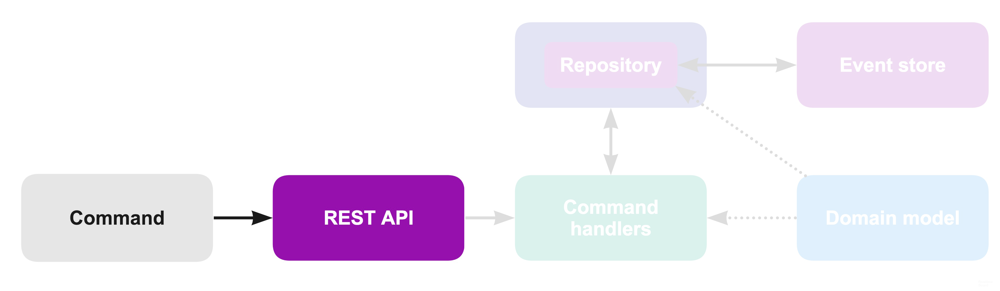

In this post, I’ve presented a project that is using **CQRS** and **Event Sourcing** patterns. It’s organized using **onion architecture** and written with **TypeScript**.


## “flexible” how?

I’m using the term _flexible_ to promote an architecture which is able to adapt to different kind of environments. More precisely, I’m trying to:

- separate core business logic from implementation details
- be independent of any database, framework or service
- use simple pure functions whenever possible
- make the project easy to scale “horizontally”
- make the project easy to test
- use type system primarily to communicate the “ubiquitous language” of the core domain

**A word of caution:** Some parts of the project may be over-engineered!

The CQRS pattern can be used without the Event sourcing and you don’t have to follow the “Onion architecture” or use a type system.  
However, I’m combining all of it together primarily to test and learn about them so I hope you can cherry-pick techniques that you find useful.

## Project details

The project I’m building can be described as a platform which helps authors (developers, artists, writers etc.) receive feedback early on and reach the audience for their work regardless of their popularity.   
It’s an online adaptation of a scientific journal publishing and peer reviewing.

For this post, it’s sufficient to understand that there are three main entities which are shaping a domain model of the application:

- **article** — a submission (like a blog post or a youtube video) an author is promoting
- **journal** — collection of articles which are accepted only if a set of rules defined by the journal is satisfied
- **user** — an author or a peer reviewer with a rank that grants them some privileges (similar to [StackOverflow’s ranking system](https://stackoverflow.com/help/privileges))

## Every action causes a reaction

I will try to explain the Event sourcing pattern using my project as an example. But, if this is the first time you heard of it, I suggest you also take a look at [this](https://www.youtube.com/watch?v=8JKjvY4etTY) talk.

> In Event sourcing (ES) we can look at a system and say that there are actions and every action causes a reaction. The action, in this case, can be implemented as **commands** and the reactions as **events**. ([source](https://lostechies.com/gabrielschenker/2015/06/06/event-sourcing-applied-the-aggregate/))


It’s however much easier to present the project the other way around —from reactions to actions.

So, without further ado, here is a list of events currently used in the project:


**_Note: “_**_Journal”, “Article” and “User” are separate units which I will refer to as_ **_aggregates_** _(even though its_ [_”object-oriented definition”_](https://martinfowler.com/bliki/DDD_Aggregate.html) _doesn’t fit exactly in my model, its general purpose is the same)_

After I was satisfied with the event list, I’ve defined each type in more detail (using TypeScript):


Depending on whether these events are used for capturing a change in the system or as a source of data for reporting, the application is divided into two sides:

- **write side** (or a command side) —deals with issues of event storage, ensuring business rules and handling commands
- **read side** (or a query side) —takes events produced by the write side and uses them to build and maintain a model that is suitable for answering the client’s queries

In short, it’s a typical **CQRS** application where we _segregate_ the _responsibility_ between _commands_ (write requests) and _queries_ (read requests):


<span style="font-size:0.5em; text-align: center; margin-top: -35px; display:block">[_source_](http://davidpallmann.blogspot.hr/2012/04/docshare-illustrating-cqrs-pattern-with.html)</span>

In this post, I will write mostly about the write side of the application (which is usually more complicated one).

## Mental model for storing events

The mental model for storing events in an Event Sourcing system is simple—new events are appended to a list and can later be retrieved from the list. Also, when stored, an event is never deleted or updated.

So, it’s basically a switch from a CRUD model (create, read, update, delete) to a CR model (create, read).

When I first started learning about event sourcing, I always imagined a giant list of events that I load up every time I had to make a change (I thought that I should use all events for _hydrating_ a **single** _aggregate_)_._

But there is a problem with this approach which results in blocking issues at the database level or failed updates (due to pessimistic concurrency).

**_Note:_** _For a more detailed explanation on “Consistency boundaries” I suggest reading “_[_Patterns, Principles and Practices of DDD_](https://www.amazon.com/Patterns-Principles-Practices-Domain-Driven-Design/dp/1118714709)_” (Chapter 19 — Aggregates)._

Long story short, a better way to think about event storage is that there are multiple event lists (**event streams**) and each one contains events that correspond to a different aggregate.

For example, for journals that would look something like this:


**_Note:_** _Exact details on how events are actually persisted in a SQL or a NoSQL database or how pessimistic or optimistic locking is done is out of the scope of this blog post._

## The big picture

Even though “**action causes reaction**” statement is correct, it doesn’t really tell you much on how a command is created, captured or validated, how invariants (business rules) are ensured or how to deal with coupling and separation of concerns.

For this to explain it’s useful to be aware of the “big picture” upfront:


But with so many components in the system, it can be difficult to “see the forest for the trees”.

This is why before explaining what each component does, I will first present an architecture whose main goal is to separate technical complexities from the complexities of the domain.

It’s called the “onion architecture”:


This architecture divides the software into layers using a simple rule: **outer layers can depend on lower layers, but no code in the lower layer can depend on any code in the outer layer**.

- At the heart of the architecture is a **domain model** (containing business rules), implemented using only pure functions (easy to test)
- **Command handlers** can use a domain model and communicate with the outside world only by using injected repository which implements **repository interface** (easy to mock)
- The outermost layer has access to all inner layers. It provides the implementation of **repository** interfaces, entrypoints to the system (**REST API)**, connection to the database (**Event store**) and similar.

> Presentation, persistence, and domain logic concerns of an application will change at different rates and for different reasons; an architecture that separates these concerns can accommodate change without causing an undesired effect to unrelated areas of the codebase. ([Patterns, Principles and Practices of DDD](https://www.amazon.com/Patterns-Principles-Practices-Domain-Driven-Design/dp/1118714709))

Another neat feature of this architecture is that it tends to define your [directory structure](https://github.com/domagojk/beenion):


**_Note:_** _in most examples of an onion architecture “commandHandlers” are usually a part of the “application” layer. But, since in my case handling commands is the only thing this layer is currently doing, I decided to call it for what it is (if in the future I would need something more besides that, I will probably rename it to “application”)  
If you ever heard about the “_[_clean architecture_](https://8thlight.com/blog/uncle-bob/2012/08/13/the-clean-architecture.html)_” or “_[_hexagonal architecture_](http://alistair.cockburn.us/Hexagonal+architecture)_” (ports and adapters), note that they are almost the same as “_[_onion architecture_](http://jeffreypalermo.com/blog/the-onion-architecture-part-1/)_”._

## Authentication & formation of a command



A command is an object triggered by the user requesting some change.

It usually maps “one to one” with the resulting event:

```typescript
CreateJournal => JournalCreated
AddJournalEditor => JournalEditorAdded
ConfirmJournalEditor => JournalEdditorConfirmed
...
```

But it can sometimes trigger multiple events:

```typescript
ReviewArticle => [ArticleReviewed, ArticlePromoted, ArticleAccepted]
ReviewArticle => [ArticleReviewed, ArticleRejected]
```

There are many ways in which a command can be generated and handled, but for this project, I’m using a single REST endpoint (`/command`) which accepts a JSON object:

```typescript
{
  name: 'AddJournalEditor',
  payload: {
    journalId: 'journal-1',
    editorInfo: {
      email: 'editor@gmail.com'
    },
    timestamp: 1511865224832
  }
}
```

This object is received as a POST request and it’s then transformed into:

```typescript
{
  userId: 'xyz',
  payload: {
    journalId: 'journal-1',
    editorInfo: {
      email: 'editor@gmail.com'
    },
    timestamp: 1511865224832
  }
}
```

**_Note_**_: “behind” the_ `userId` _property is the whole authentication process which is not trivial. For that, I decided to use the_ [_Auth0_](http://auth0.com) _service (similar to “_[_Firebase Authentication_](https://firebase.google.com/docs/auth)_” or “_[_Amazon Cognito_](https://aws.amazon.com/cognito/)_”), but of course, you can use your own implementation.  
The important takeaway here is that a command handler is not bloated with the authentication complexity and assumes that the_ `_userId_` _sent from this service can be trusted._

A command object (containing `userId`) is then passed to the appropriate **command handler** (which is found by the command name).

Here is a simplified example of this process:


## Command handler — validating the input data


As presented in [this FAQ on CQRS](http://cqrs.nu/Faq), here is a common sequence of steps that a command handler follows (_slightly changed from the original_):

1.  Validate the command on its own merits
2.  Validate the command on the current state of the aggregate
3.  If validation is successful, attempt to persist new events. If there’s a concurrency conflict during this step, either give up or retry things

In the first step (“_validating a command on its own merits_”), a command handler checks the command object for any missing properties, invalid emails, URLs and similar.

For this purpose, I’m using [**io-ts**](https://github.com/gcanti/io-ts)— a runtime type system for IO validation which is compatible with TypeScript (but can be used without it as well).

**_Update:_** _in a more recent project that I did, I’ve used a_ [_Joi data validator_](https://github.com/hapijs/joi) _instead. It’s not as integrated with Typescript as io-ts but it’s simpler to use and more actively maintained._

It works by combining simple types like these ([complete example](https://github.com/domagojk/beenion/blob/master/beenion-core/domain/types/input.ts)):


into more complicated, command types ([complete example](https://github.com/domagojk/beenion/blob/master/beenion-core/domain/types/journal/commands.ts)):


which are then used to validate input data sent by the REST API.

**_Note_**_: If validation was successful, TypeScript will infer command’s types:_


At this point, a command handler has to perform the second step: “_Validate the command on the current state of the aggregate_”.

Or in other words, it has to decide which event(s) should be stored or should a command be refused by throwing an error (if some business rule is broken).

That decision is made with the help of — a **domain model**.

## Using a domain model to check business rules


A domain model is a part of the application where business rules are defined. Its implementation should be kept simple as possible (so it can be understood even by non-programmers) and isolated from the rest of the system (which is the point of the onion architecture pattern).

Continuing with the example of “adding an editor”, here is a **command handler** (with a highlighted section where function from a **domain model** is used):


`addEditor` belongs to a `journal` aggregate and it’s implemented as a simple pure function which either returns resulting event or throws an error (if any business rule is broken):


Params `userInfo` and `timestamp` originate from a **command object**. The “_current state of the aggregate”_ is represented by the `user` and `journal` objects which are retrieved using another component in the system — **a Repository**.

**_Note_**_: In case you don’t like seeing hardcoded strings, keep in mind that I’m using TypeScript which “will scream” if not used it the right way:_


_Besides compile-time errors, renaming any property or strings with a “rename symbol feature” works across all files in the project (tested in vs code)._

## Retrieving the current state of the aggregate with a repository


`userState` and `journalState` are retrieved using injected dependencies: `userRepository` and `journalRepository`:


These repositories usually contain a method called `getById`.

The job of this method is, you’ve guessed it, **getting** an aggregate state **by** its **id**.

So, in the case of a journal aggregate, it should return an object of this type:


However, the **Event store** knows nothing about the format of a journal aggregate and as previously shown, it only stores events:


Which is why I had to transform these events to a required state, using a — **reducer**.

**_Note_**_: Keep in mind, that for getting current aggregate state you don’t have to use event sourcing. Sometimes it’s more suitable to retrieve a complete object (using MongoDB or similar) and skip the part of reducing and saving events.  
But, if you are like me, and you want your model to be “flexible” (so you can easily change the format of the aggregate state in any time in the future) you have to deal with “reducers”._

A reducer is just a (pure) function (similar to [Redux reducer](https://redux.js.org/docs/basics/Reducers.html)) also defined in a **domain model**:


**_Note_**_: Again, with TypeScript, you can safely use hardcoded strings where for each case, event type should be inferred:_


## Saving events in the Event Store


The command handler’s last step is: _If validation is successful, attempt to persist new events. If there’s a concurrency conflict during this step, either give up or retry things._

Besides the _aggregate state,_ a repository will also return the `save` function which is then used for persisting events:

')

Under the hood, events are persisted using the optimistic concurrency control to ensure consistency (similar to [mongoDB approach](https://docs.mongodb.com/v3.2/faq/concurrency/) but without the “auto-retry”).

**_Note:_** _I’m using optimistic locking based on an event version retrieved on a write side rather than a read side._ _That is a conscious decision I made for my domain and if you attempt to use this solution for yourself, make sure you understand the tradeoffs (which, I won’t explain in this blog post since it’s already long enough)  
If you, however, decide to use versions retrieved at the read side, you can pass a version number like this:_ `save(events, expectedVersion)`

## Summary of the application flow on the write side


1.  **Command** is an object sent by the user (from the UI)
2.  **REST API** receives a command and handles user authentication
3.  “authenticated command” is then sent to a **command handler**
4.  **Command handler** makes a request to a **repository** for the _aggregate state_
5.  **Repository** retrieves events from the **event store** and transforms them to an _aggregate state_ using a _reducer_ defined in a **domain model**
6.  **Command handler** validates the command on the current state of the aggregate using a **domain model** which responds with resulting events
7.  **Command handler** sends resulting events to a **repository**
8.  **Repository** attempts to persist received data in the **event store** while ensuring consistency using optimistic locking

## The Read Side

Using events for recreating the _aggregate state_ is not very complex nor expensive.

However, an event store is NOT suitable for running queries across aggregates. For example, a query like: “_select all journals whose name starts with xyz_” would require rebuilding all aggregates which is too expensive (not to mention more complex queries that are a big source of “money drain” in a monolithic CRUD application as well).

This is a problem solved on the **read side**.

In short, a read side listens to events published from the write side, projects those events down as changes to a local model, and allows queries to be made on that model _(_[_source_](http://cqrs.nu/Faq/read-sides)_)_.

By building a model (or model**s**) that is maintaining a database specialized for any kind of query you can save a lot of processing power.

I think this is worth reiterating:

> If your your hosting bill is unjustifiably high mostly due to complex queries - you should consider CQRS/ES architecture.

Since a read side will always “be behind” the write side (even by a fraction of a second) the application becomes “**eventually consistent**”. That is the main reason why it’s cheaper and easily scalable, but also it’s the reason why the write side is more complex in contrast to a monolithic CRUD application.

## Conclusion

I like thinking in events. It makes me focus on a domain rather than a database schema and you don’t even have to be a programmer to understand them. This fact makes you communicate with domain experts more easily (a big part of [DDD](https://www.amazon.com/Domain-Driven-Design-Tackling-Complexity-Software/dp/0321125215)).

Also, the nature of this architecture had forced me not to take consistency for granted and thus learn more about it (which is really beneficial when working with microservices).

But, like everything, these patterns have their costs. If you don’t see yourself using all of them together, perhaps you can use parts of it.

As I’ve already mentioned; the CQRS pattern can be used without the Event sourcing and you don’t have to follow the “Onion architecture” or use a type system. For example, you can:

- use a similar model where events are replaced with objects persisted in a NoSQL database (no event sourcing)
- use reducers from a write model for client queries (no CQRS)
- use onion architecture to build **#serverless applications** (with “lamdas” or “cloud functions”) more easily (by mocking infrastructure layer in “development stage”)
- use types in a similar fashion where a domain is presented in a fine-grained, self-documenting way ([type-first development](http://tomasp.net/blog/type-first-development.aspx/))
- use a runtime type system for IO validation (like io-ts)

## Resources

- Martin Fowler — Event Sourcing ([video](https://www.youtube.com/watch?v=aweV9FLTZkU), [article](https://martinfowler.com/eaaDev/EventSourcing.html))
- Martin Fowler — CQRS ([article](https://martinfowler.com/bliki/CQRS.html))
- Greg Young — Event Sourcing ([video](https://www.youtube.com/watch?v=8JKjvY4etTY))
- Alberto Brandolini — Event Storming ([article](http://ziobrando.blogspot.hr/2013/11/introducing-event-storming.html#.VbhQTn-9KK1))
- Chris Richardson — Developing microservices with aggregates ([video](https://www.youtube.com/watch?v=7kX3fs0pWwc))
- Scott Millett — Patterns, Principles, and Practices of DDD ([book](https://www.amazon.com/Patterns-Principles-Practices-Domain-Driven-Design/dp/1118714709))
- CQRS.nu — FAQ ([article](http://cqrs.nu/Faq))
- MSDN — Introducing Event Sourcing ([article](https://msdn.microsoft.com/en-us/library/jj591559.aspx))
- Scott Wlaschin — Domain Driven Design ([video](https://goo.gl/kxVAWt), [article](http://fsharpforfunandprofit.com/ddd/))
- Mark Seemann — Functional architecture is Ports and Adapters ([article](http://blog.ploeh.dk/2016/03/18/functional-architecture-is-ports-and-adapters/), [video](https://www.youtube.com/watch?v=US8QG9I1XW0))

# Join the Newsletter

You can subscribe to get my latest content by email [here](https://mailchi.mp/8df8f0796b1f/devadvice)
