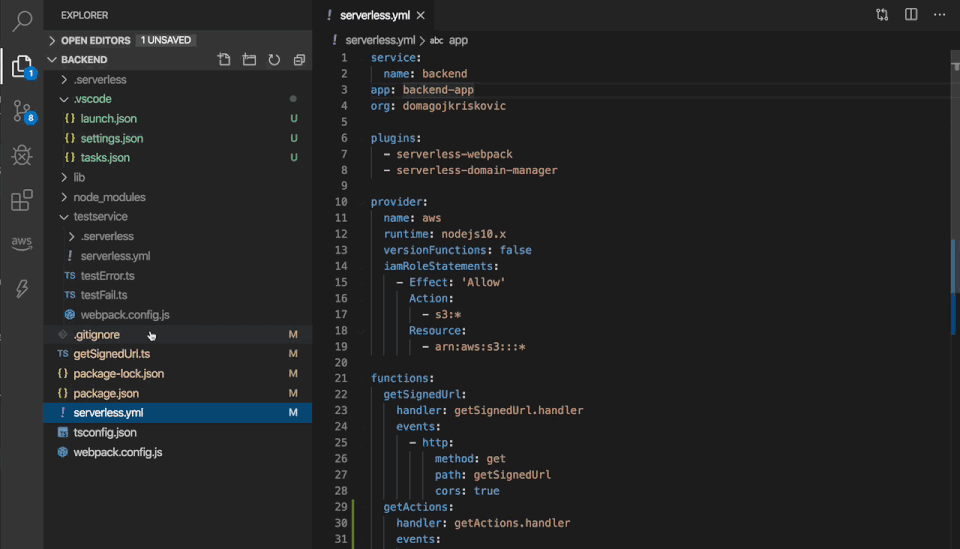

Trying to find logs for Lambda functions in CloudWatch is not an enjoyable experience.

Some of the issues that I've faced are:

- Finding the log group is not easy and tends to get harder as more functions are deployed. Also, I don't remember I ever typed `/aws/lambda/service-stage-prefix` which is suppose to help with it
- Searching for logs on the wrong stage (for example `dev` instead of `prod`)
- Constantly matching logged time with my clock (and adding/subtracting hours to match my timezone)

Because of that, I wrote a relatively simple VS Code extension that tackles those issues.

- Log groups are grouped per project and correspond to a single Serverless service (even though it's also possible to use it without serverless framework)
- Stages are shown per function on its own tab
- Times are shown relative to current timestamp (like "2 minutes ago")
- START / END of a request is more clear because memory size and duration are formatted differently

**Note: it works only for AWS at the moment**

[Click here](https://marketplace.visualstudio.com/items?itemName=devAdvice.serverlessconsole) to download the extension.

# Join the Newsletter

You can subscribe to get my latest content by email [here](https://mailchi.mp/8df8f0796b1f/devadvice)
